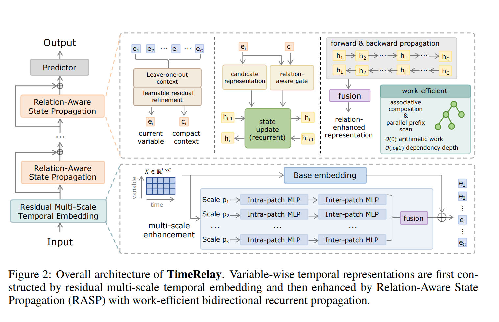
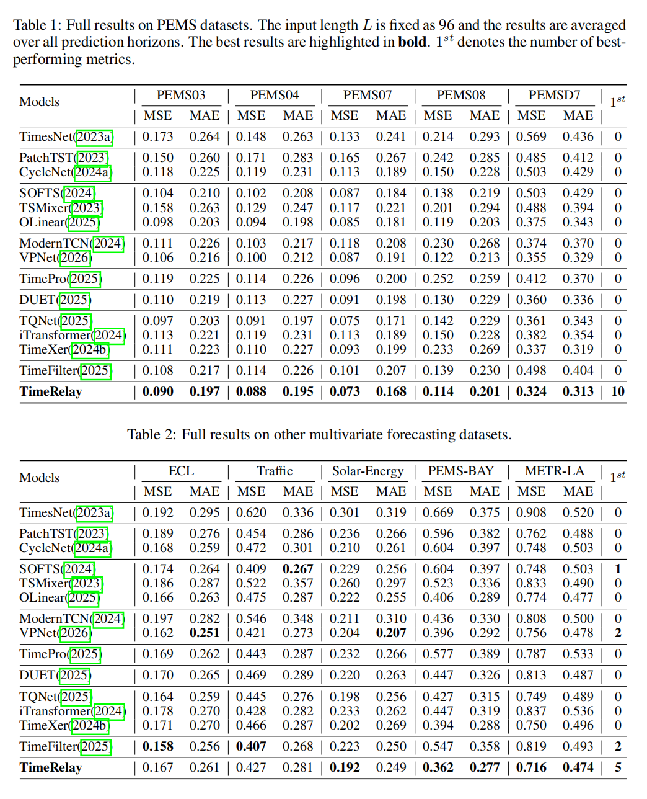
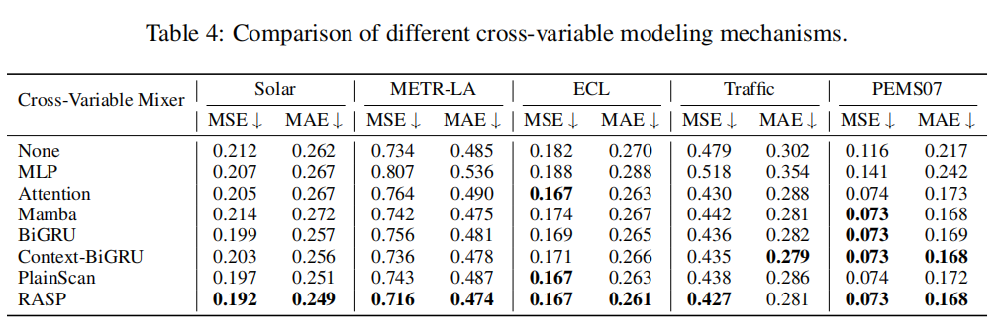
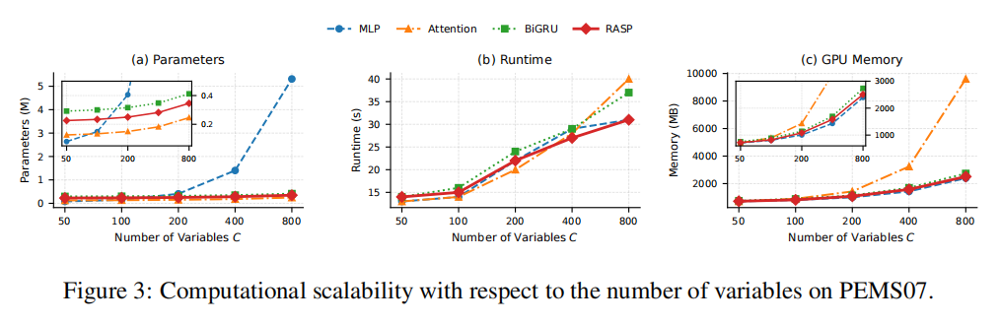
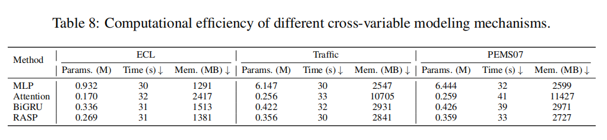
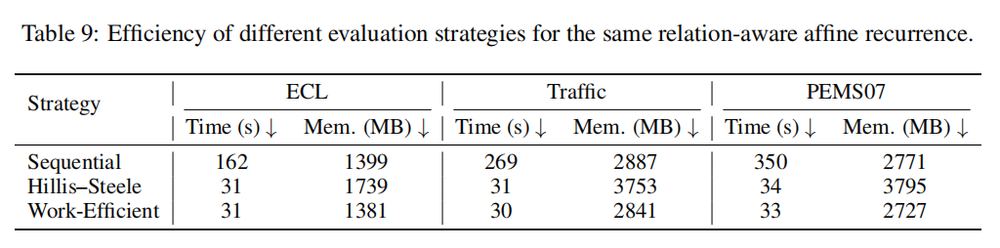
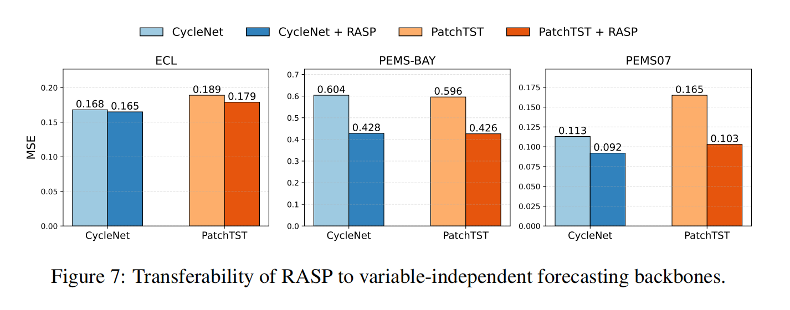
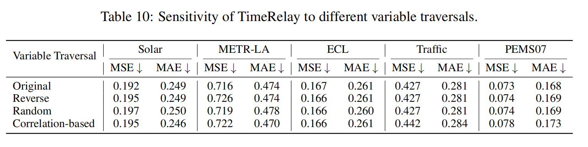

# TimeRelay: Relation-Aware Recurrent Variable Modeling for Multivariate Time Series Forecasting


## Overview

TimeRelay models cross-variable dependencies from the perspective of **predictive information propagation** rather than explicitly materializing dense variable-to-variable interactions.

Its core module, **Relation-Aware State Propagation (RASP)**, constructs a compact multivariate context for each variable and uses the variable--context relation to adaptively control recurrent state updates. The resulting affine recurrent form supports work-efficient parallel evaluation with linear arithmetic work in the number of variables and logarithmic dependency depth.

TimeRelay first constructs variable-wise temporal representations using a residual multi-scale temporal embedding and then applies RASP to propagate predictive information across variables. Bidirectional propagation is further used to reduce the directional asymmetry introduced by a single computational traversal.


## Highlights

- **Relation-aware recurrent propagation** for cross-variable dependency modeling
- **Compact leave-one-out multivariate context** with learnable residual refinement
- **Relation-aware gating** based on the current variable and multivariate context
- **Residual multi-scale temporal embedding** for variable-wise temporal modeling
- **Work-efficient parallel prefix scan** for recurrent evaluation
- **Bidirectional propagation** to reduce traversal asymmetry
- Strong forecasting performance across **ten multivariate benchmarks**
- Favorable runtime, memory usage, and scalability
- Good transferability to representative variable-independent forecasting backbones


## Architecture

The overall architecture of TimeRelay is shown below:

<p align="center">
  
</p>

TimeRelay consists of three main stages:

1. **Residual Multi-Scale Temporal Embedding**
   - independently encodes each variable along the temporal dimension;
   - combines a linear base embedding with lightweight multi-scale residual enhancement.

2. **Relation-Aware State Propagation (RASP)**
   - constructs a compact multivariate context for each variable;
   - uses variable-context relations to control recurrent state transitions;
   - propagates predictive information across variables through evolving recurrent states.

3. **Prediction Head**
   - maps the relation-enhanced variable representations to the forecasting horizon.

The affine form of the RASP transition allows the recurrent computation to be evaluated using a work-efficient parallel prefix scan, reducing the ideal dependency depth from linear to logarithmic in the number of variables.


## Repository Structure

```text
TimeRelay/
├── data_provider/        # Dataset loading and preprocessing
├── exp/                  # Experiment pipeline
├── models/               # Model definitions
├── utils/                # Utility functions
├── dataset/              # Benchmark datasets
├── figure/               # Figures used in README
├── TimeRelay.sh          # Script for reproducing experiments
├── requirements.txt      # Python dependencies
└── README.md
```

## Installation

1. Create a Python environment with **Python 3.8**.

2. Install dependencies:

```bash
pip install -r requirements.txt
```


## Data Preparation

All benchmark datasets can be downloaded from [Google Drive](https://drive.google.com/file/d/1MKugRwUKN2u9tIBgES-n3-QOT5l6unLl/view?usp=drive_link).

After downloading, place the datasets under the `./dataset` directory. For example:

```text
./dataset/electricity/electricity.csv
```

Please ensure that the dataset directory structure matches the expected paths used in the code.

TimeRelay is evaluated on ten public multivariate forecasting benchmarks:

- **Long-horizon forecasting:** ECL, Traffic, Solar-Energy
- **Short-horizon forecasting:** PEMS03, PEMS04, PEMS07, PEMS08, PeMSD7(M), PEMS-BAY, METR-LA

The input length is fixed to 96 in the main experiments. Prediction horizons are:

```text
Long-horizon:  {96, 192, 336, 720}
Short-horizon: {12, 24, 48, 96}
```


## Quick Start

To reproduce the main experimental results reported in the paper, run:

```bash
sh TimeRelay.sh
```

This script reproduces the benchmark experiments for TimeRelay across multiple datasets and forecasting settings.


## Experimental Results

### Overall Performance on Different Datasets

TimeRelay is evaluated across datasets with substantially different variable dimensionalities and temporal characteristics. The reported results are averaged over all prediction horizons for each dataset.

<p align="center">
  
</p>

TimeRelay achieves strong overall forecasting performance across the ten benchmarks. In particular, it performs especially well on several high-dimensional traffic forecasting datasets, while remaining competitive on long-horizon benchmarks such as ECL and Traffic.

### Comparison with Different Cross-Variable Modeling Methods

To examine whether the gains mainly come from introducing cross-variable modeling in general or from the specific design of RASP, we replace RASP with several representative cross-variable modeling mechanisms while keeping the remaining architecture unchanged.

The compared alternatives include:

- no cross-variable modeling,
- MLP-based variable mixing,
- Attention,
- Mamba,
- BiGRU,
- Context-BiGRU, and
- PlainScan.

<p align="center">
  
</p>

The results show that simply introducing a cross-variable mixer does not necessarily improve forecasting performance. RASP provides the most consistent overall results among the compared mechanisms, indicating that the combination of compact multivariate context, relation-aware gating, and affine state-mediated propagation is important for effective cross-variable modeling.

### Scalability

We further study how different cross-variable modeling mechanisms scale as the number of variables increases.

Using PEMS07, we construct subsets with:

```text
C = {50, 100, 200, 400, 800}
```

and compare parameter count, runtime per epoch, and GPU memory usage under the same computational setting.

<p align="center">
  
</p>

RASP provides a balanced scaling profile across parameter count, runtime, and memory. It avoids the rapidly increasing parameterization of MLP-based variable mixing and the large memory growth of Attention caused by explicit pairwise interaction.

At `C = 800`, RASP requires:

```text
Parameters: 0.346M
Runtime:    31 s / epoch
GPU memory: 2509 MB
```

Compared with Attention, RASP reduces runtime by **22.5%** and GPU memory usage by **73.9%** in this controlled setting.

### Efficiency

We compare the computational efficiency of different cross-variable modeling mechanisms using the same temporal embedding and prediction head.

<p align="center">
  
</p>

The comparison reports parameter count, runtime per epoch, and GPU memory usage on ECL, Traffic, and PEMS07. RASP avoids the high memory cost of explicit pairwise Attention while maintaining competitive runtime and compact parameterization.

We also compare three evaluation strategies for the same relation-aware affine recurrence:

- **Sequential evaluation**
- **Hillis--Steele parallel scan**
- **Work-efficient parallel scan**

<p align="center">
  
</p>

The work-efficient scan replaces the linear recurrent dependency chain with a logarithmic-depth tree-based evaluation while preserving the same recurrent computation up to floating-point differences. On PEMS07, it reduces runtime from **350 s** under sequential evaluation to **33 s**.

### Transferability of RASP

To examine whether RASP is specific to the TimeRelay architecture, we further integrate it into two representative variable-independent forecasting backbones: **CycleNet** and **PatchTST**.

<p align="center">
  
</p>

RASP consistently improves both backbones across ECL, PEMS-BAY, and PEMS07. This provides additional evidence that relation-aware state propagation can complement variable-independent temporal modeling and is not limited to the specific backbone used in TimeRelay.

### Sensitivity to Variable Traversal

Because variables in multivariate time series generally do not have a canonical sequential ordering, we evaluate TimeRelay under several alternative traversal strategies:

- original order,
- reverse order,
- random permutation, and
- correlation-based ordering.

<p align="center">
  
</p>

The results show that TimeRelay remains effective under different traversal choices. This analysis studies **traversal sensitivity** rather than claiming permutation invariance.


